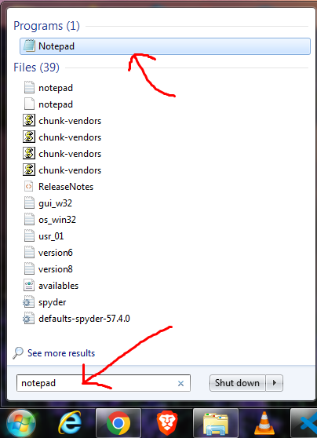
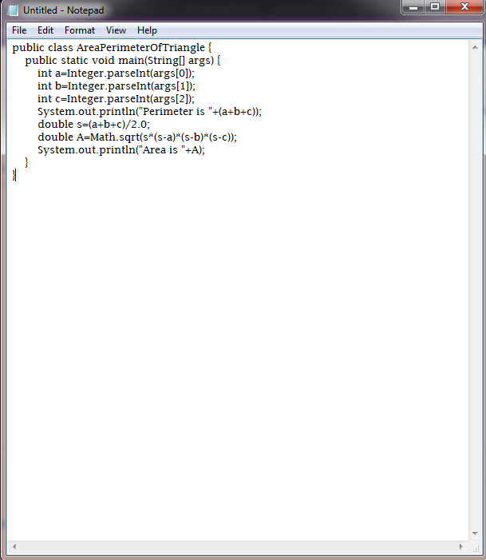
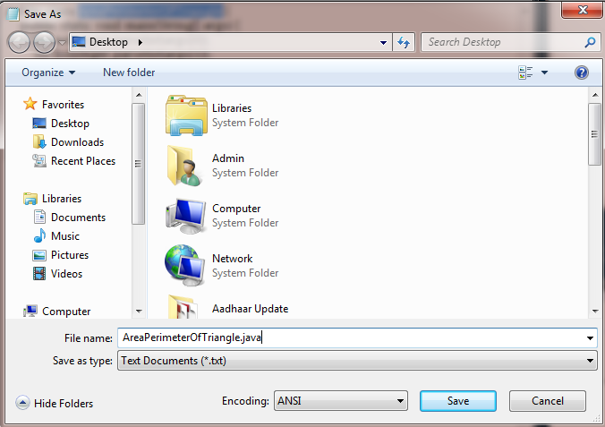
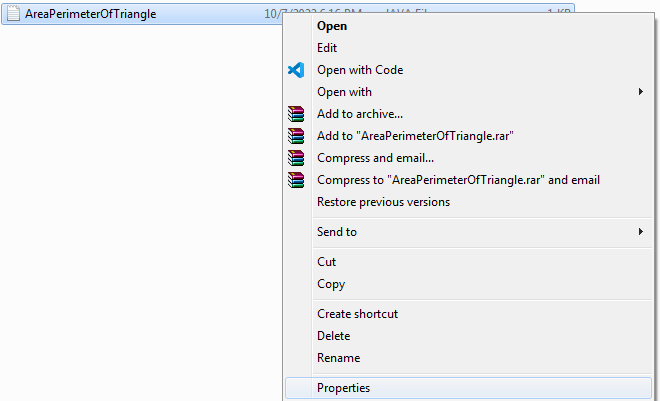
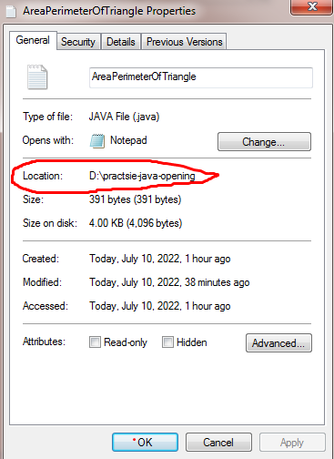
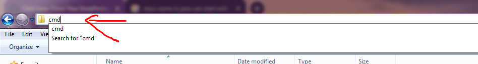
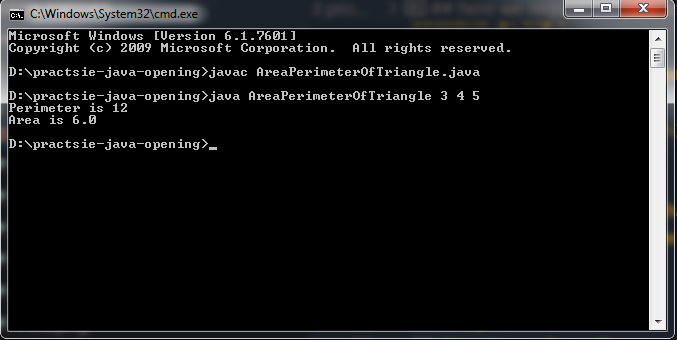
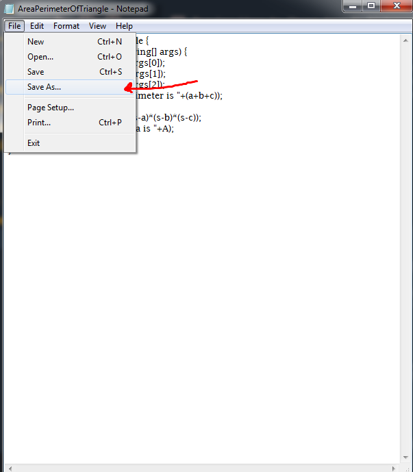
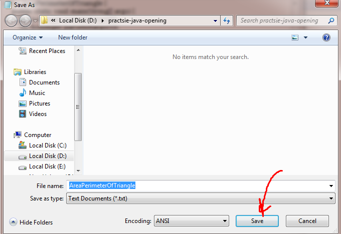

# Steps on how to write Java in Notepad
## *Step 1*
## Press windows on keyboard
## Type notepad
## click on it

---
## *Step 2*
## Following Pic appears

## Write your program in it:-

## Click on save

## file name should be same as class name
## Write  programName.java(here it is:-AreaPerimeterOfTriangle.java) and click on save

# Now you have made your java file
# We will execute it using command prompt

## Lets find out where our java file was made
## Right click on your java file and click on properties

## View the file location

## Now,For opening command prompt go to the folder where your .java file was created with help of location you found just now
---
## *Step 3*
## Have a look at where the arrow is pointing->
## It is location of the file AreaPerimeterOfTriangle.java

## *Step 4*
## Click on it

---
## *Step 5*
## Type **cmd** and press enter

## **Step 6**
## Following pic appears

---
## Now we have opened the command prompt
---
## **Step 7**
## write javac ProgramName.java
## (Here it is javac AreaPerimeterOfTriangle.java)

## if any errors would have been there it would have shown up now
## the .class file is created in step 7
---
## **Step 8**
## Now type java ProgramName along with the inputs
## here we require 3 inputs so follow the pic carefully to see how the **command line arguments** have been entered after writing java ProgramName

## in the pic 3 4 5 are inputs which are args[0], args[1], args[2] correspondingly in java program
## the desired output is got.
---
## **Step 9**
## Whenever you make a change in your java file click on save as

---
## **Step 10**
## Click on *save*

---
## **Step 11**
## Click on *yes*

## **Step 12**
## Do step 7 and step 8 again.

-----------------------

